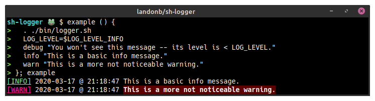
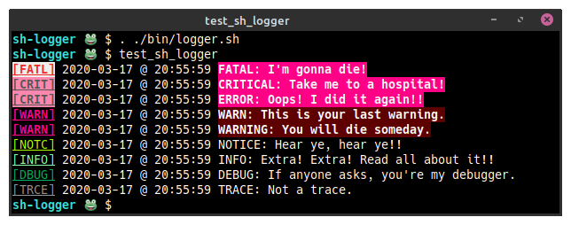

# `sh-logger`

POSIX-compliant, Python-esque loggers (and log levels) for the shell.

*Enrich your command line!*

## Usage

Source the `bin/logger.sh` library to expose a collection of
colorful, time-stamping loggers and associated log levels.



E.g.,

  ```shell
  $ . logger.sh
  $ LOG_LEVEL=$LOG_LEVEL_WARNING error "Did you see that!?"
  [CRIT] 2020-03-17 @ 19:40:42 Did you see that!
  $ LOG_LEVEL=$LOG_LEVEL_INFO debug "Yeah, but you can't see me!"
  ```
## Installation

The author recommends cloning the repository and wiring its `bin/` to `PATH`.

You can also create a symlink to the library (`logger.sh`) from a location
already on `PATH`, such as `~/.local/bin`.

Or you could clone the project and load the library to evaluate it first,
before deciding how you want to wire it.

Alternatively, you might find that using a shell package manager, such as
[`bkpg`](https://github.com/bpkg/bpkg),
is more appropriate for your needs, e.g.,
`bpkg install -g landonb/sh-logger`.

### Makefile install

The included `Makefile` can also be used to help install.

- E.g., you could clone this project somewhere and
  then run a `sudo make install` to install it globally:

  ```shell
  git clone https://github.com/landonb/sh-logger.git
  cd sh-logger
  # Install to /usr/local/bin
  sudo make install
  ```

- Specify a `PREFIX` to install anywhere else, such as locally, e.g.,

  ```shell
  # Install to $USER/.local/bin
  PREFIX=~/.local/bin make install
  ```

  And then ensure that the target directory is on the user's `PATH` variable.

  You could, for example, add the following to `~/.bashrc`:

  ```shell
  export PATH=$PATH:$HOME/.local/bin
  ```

### Manual install

If you clone the project and want the library functions to be
loaded in your shell, remember to ensure that it can be found
on `PATH`, and then source the library file, e.g.,

  ```shell
  git clone https://github.com/landonb/sh-logger.git
  export PATH=$PATH:/path/to/sh-logger/bin
  . logger.sh
  ```

## API

After installing the `logger.sh` script, and ensuring
that `PATH` is configured correctly, you can easily load it
from any directory by sourcing it:

  ```shell
  . logger.sh
  ```

Look inside the `logger.sh` source code for the list of logger
functions and log levels that are available.

You can also run `test_sh_logger` to see an example of the loggers.

### `test_sh_logger`

Run `test_sh_logger` to see the list of loggers.

  ```shell
  $ test_sh_logger
  ```



### `fatal` ... `verbose`

The loggers are simply named, e.g., `debug`, and can be used like `echo`,
e.g.,

  ```shell
  $ warn "foo bar"
  ```

Here's the list of loggers and their level values. A logger will only print
the message it's passed if the current `LOG_LEVEL` is greater than or equal
to the logger's corresponding log level value.

  ```
  function name     level variable        level value
  -------------     --------------        -----------
  fatal             LOG_LEVEL_FATAL       50
  critical          LOG_LEVEL_CRITICAL    50
  error             LOG_LEVEL_ERROR       40
  warning           LOG_LEVEL_WARNING     30
  warn              LOG_LEVEL_WARNING     30
  notice            LOG_LEVEL_NOTICE      25
  info              LOG_LEVEL_INFO        20
  debug             LOG_LEVEL_DEBUG       15
  trace             LOG_LEVEL_TRACE       10
  verbose           LOG_LEVEL_VERBOSE      5
  ```

Enjoy!

